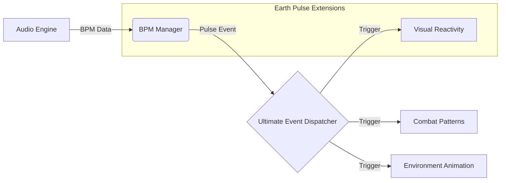

# Earth Pulse | Music-Driven Gameplay Extension

**Earth Pulse** is a polished prototype of a rhythm-based combat RPG that uses a specialized extension of the <a href="https://github.com/Jisas/UltimateController">Ultimate Controller</a> designed for music-driven games. This project adds a layer of rhythmic synchronization (BPM Tracking) and music authoring tools that allow the environment and game mechanics to react in real time to the flow of audio.

## 🏗️ Rhythm Synchronization Architecture

The primary technical challenge was decoupling the music's rhythm from Unity's frame rate (FPS). I implemented a **BPM Manager** that serves as the game's "Master Clock."

### Rhythm Event Flow
This diagram illustrates how I extended the framework's event system to process audio data:

## 🛠️ Engineering Extensions (Audio Focus)
### 1. BPM & Beat Tracking System
I extended the framework's core to include a pulse-tracking engine:
- Audio Thread Sync: An algorithm to calculate precise BeatTime based on Unity’s audio head position (AudioSettings.dspTime), effectively eliminating "drift" or rhythmic desync.
- Predictive Beat Events: A system that fires events milliseconds before the actual pulse, allowing UI and enemy animations to reach their "peak" exactly on the beat.

### 2. Visual Reactivity Modules
Developed specific scripts that utilize the framework to transform audio frequencies into gameplay data:
- Spectrum Analysis Bridge: A bridge between AudioSource.GetSpectrumData and material properties, enabling the world to "pulse" rhythmically.
- Custom Editor for Audio Mapping: A dedicated Editor Window (built with UI Toolkit) that allows designers to map specific frequency ranges to framework-based events.

### 3. Ultimate Framework Integration
Earth Pulse doesn't just use the framework; it inherits and specializes it:
- Rhythm Actions: New Action types that only execute if player input falls within the allowed timing window (latency).
- Conditional Sync: Custom Conditions that verify if the "Earth Pulse" (the planet/music pulse) is in the correct state to permit progression.

## 📂 Extension Structure
- /Scripts/AudioCore: BPM synchronization engine and spectrum analysis.

- /Scripts/VisualReactivity: Components that react to music pulses.

- /Editor/MusicTooling: Inspector extensions for beat configuration and latency windows.

- /Runtime/RhythmGameplay: Gameplay mechanics directly dependent on the rhythmic clock.

## 🚀 Technical Challenge Solved: Latency Management
"The biggest hurdle in rhythmic games is audio latency across different devices. Earth Pulse solves this by implementing a dynamic Input Buffering window. The framework validates player commands by comparing the dspTime of the input against the dspTime of the nearest pulse, ensuring a fluid experience regardless of CPU performance."

## 👨‍💻 Author

  
  <h4>Jesús Carrero - Unity Gameplay Engineer</h1>
  

